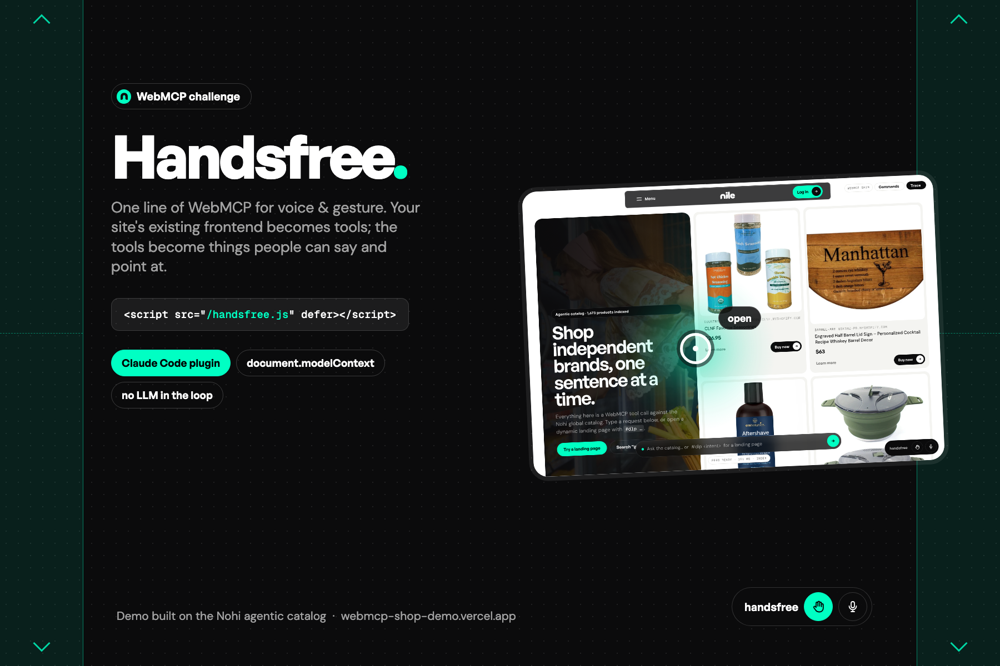

# Handsfree — one line of WebMCP for voice & gesture



**Give any website you can edit voice commands and hand-gesture control, with one command to your Claude Code and one `<script>` line in the page.**

WebMCP (the W3C Web Machine Learning draft, `document.modelContext`) lets a page expose what it can do as *tools* — named functions with a description and a JSON schema. Handsfree is the other half: an input layer that reads those tools and drives them from speech and from a camera, with no LLM in the loop.

```
┌────────────────────────── your site ──────────────────────────┐
│  existing frontend  ──►  Claude Code skill  ──►  WebMCP tools │
│                             (audits code,        registerTool │
│                              wires real fns)     on modelContext
│                                                       ▲        │
│  <script src="/handsfree.js" defer></script>  ───────┘        │
│   voice (Web Speech)  ·  gestures (MediaPipe)  ·  rule router │
└───────────────────────────────────────────────────────────────┘
```

Live demo: https://webmcp-shop-demo.vercel.app (a product-discovery site where every capability is a WebMCP tool; the floating input, voice and gestures are three clients of the same tools).

## What you get

| piece | file | what it does |
|---|---|---|
| Claude Code skill | `plugins/handsfree/skills/handsfree/SKILL.md` | Recon of the codebase → registers the page's real actions as WebMCP tools (scroll, search/text-sink, focus, open, primary CTAs with confirm) → injects the runtime → verifies in the browser → reports |
| Injector | `scripts/inject.py` | Copies the runtime next to the entry HTML and inserts the one line after `<meta charset>`; idempotent, `--remove`, `--dry-run`, language/wake-word/feature flags |
| Runtime | `assets/handsfree.js` (~50 KB, zero deps) | Discovers tools (`window.WebMCP` registry, or by wrapping `document.modelContext.registerTool`, or a polyfill); voice → rule router → tool; camera → cursor / tap / scroll bands / waves → tool; NILE-style dock; interactive tutorial; translucent dot-field overlay |
| Reference | `reference/tool-authoring.md` | The draft API precisely, the `annotations.handsfree` extension (`role: text-sink | scroll | dismiss`, `phrases`, `confirm`), framework notes |

## Install

```bash
claude plugin marketplace add Haozhuang479/handsfree-webmcp     # or a local path
claude plugin install handsfree@handsfree
```
Then, inside any project: **"handsfree — make this site voice and gesture controlled"**.

Without Claude Code, the runtime alone still works on any page that registers WebMCP tools:
```html
<script src="/handsfree.js" defer></script>
```

## How the runtime decides what to do (no LLM)

1. Built-in intents: scroll up/down, top/bottom, back/forward, close, next/previous, open (number N / the third one), buy it (asks "say yes"), more, cheaper/pricier, browse everything, what is this, help, stop, yes/no.
2. Tool `annotations.handsfree.phrases` and tool names as words ("load more").
3. Everything else → the tool annotated `role: "text-sink"` (the site's own natural-language entry).

Speech quirks are undone before matching ("page 4" → "page for", "fifty dollars" → $50, "dlp" → "landing page for"); price phrases become `max_price` / `min_price` and are stripped from the query.

Gestures: the index fingertip is a cursor (a hand resting in the lower-left or lower-right of the camera frame drives the whole viewport); an air-tap of the index finger clicks; the outer left/right bands scroll up (top half) or down (bottom half), faster towards the edge; an open-hand wave right goes back, left goes forward. Everything is drawn on a fine dot field that bulges under the cursor.

Popups: gesture and voice actions carry no user activation, so the runtime navigates the current tab for synthetic clicks on `target=_blank` links and asks the site for an in-page panel ("open" → product sheet in the demo); "back" closes a visible `[data-hf-dismiss]` control or a `role: "dismiss"` tool first.

## Repo layout

```
.claude-plugin/marketplace.json
plugins/handsfree/
├── .claude-plugin/plugin.json
├── README.md
└── skills/handsfree/{SKILL.md, assets/handsfree.js, scripts/inject.py, reference/tool-authoring.md}
```

## Status

WebMCP is a W3C Web Machine Learning Community Group draft (Chrome 146+ behind a flag, 149+ origin trial as of Sept 2026). The runtime forwards to a native `document.modelContext` when one exists and works without it. See `CHANGELOG.md`.

## License

MIT — see [LICENSE](LICENSE).
